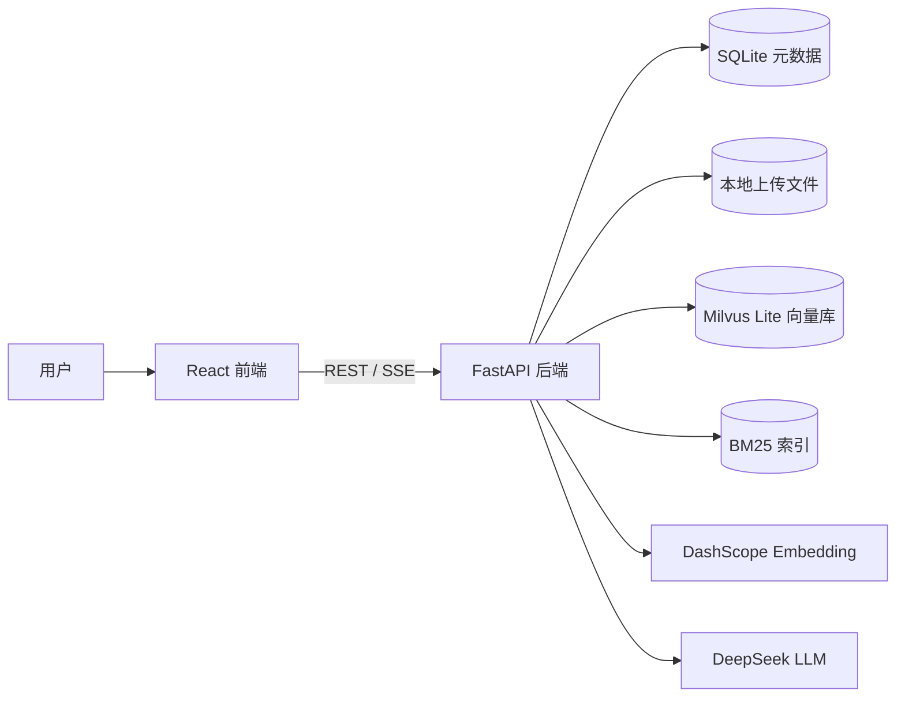
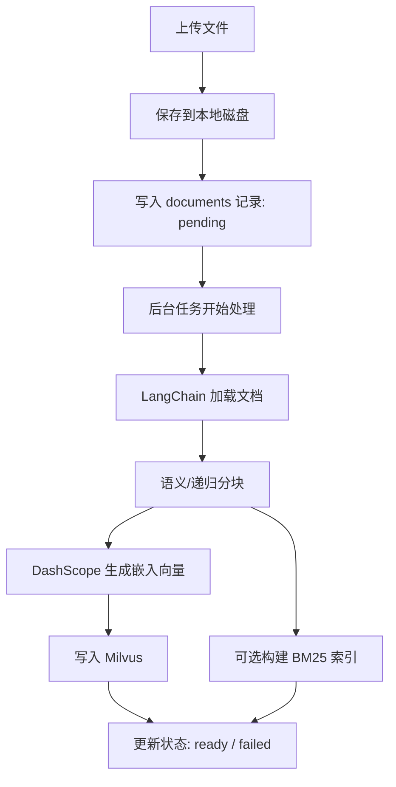
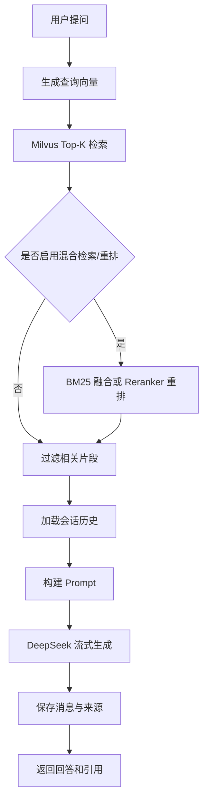

# RAG Knowledge System

> 一个基于 **RAG（Retrieval-Augmented Generation，检索增强生成）** 的本地知识库问答系统。
> 支持上传文档、自动构建向量索引，并通过 DeepSeek 大模型结合检索内容生成可追溯的回答。

<p align="left">
  
  
  
  
  
  
</p>

## 目录

- [项目亮点](#项目亮点)
- [技术栈](#技术栈)
- [系统架构](#系统架构)
- [项目结构](#项目结构)
- [快速开始](#快速开始)
- [使用流程](#使用流程)
- [配置说明](#配置说明)
- [API 概览](#api-概览)
- [支持的文件格式](#支持的文件格式)
- [数据存储](#数据存储)
- [常见问题](#常见问题)
- [License](#license)

## 项目亮点

- **开箱即用**：Milvus Lite 嵌入式向量库，无需额外部署 Docker 服务。
- **异步文档摄入**：上传后后台解析、分块、向量化、入库，并实时记录处理状态。
- **流式问答体验**：后端基于 SSE 推送生成内容，前端逐字呈现大模型回复。
- **知识来源可追溯**：回答返回引用片段、文档名、分块索引及相似度分数。
- **多策略检索**：支持向量检索，可选 DashScope Reranker 与 BM25 + Vector 混合检索。
- **结构化分块**：默认使用语义/结构感知分块，失败时自动回退到递归分块。
- **完整知识库管理**：支持知识库、文档、索引、会话与消息历史管理。

## 技术栈

| 模块 | 技术选型 | 说明 |
| --- | --- | --- |
| 后端 API | FastAPI + Uvicorn | REST API、SSE 流式响应、异步任务 |
| RAG 编排 | LangChain | 文档加载、分块、检索与生成编排 |
| 大模型 | DeepSeek | 通过 OpenAI 兼容接口调用 |
| 嵌入模型 | DashScope `text-embedding-v4` | OpenAI 兼容接口，无需本地 GPU |
| 向量数据库 | Milvus Lite | 嵌入式向量存储，零配置启动 |
| 关系数据库 | SQLite + aiosqlite | 知识库、文档、会话、消息元数据 |
| 检索增强 | DashScope Reranker、BM25 | 可选重排与混合检索能力 |
| 前端 | React 19 + TypeScript + Vite | 单页应用与组件化界面 |
| UI 样式 | Tailwind CSS 4 + lucide-react | 响应式布局与图标 |
| 状态管理 | Zustand | 前端全局状态管理 |

## 系统架构



### 文档摄入流程



### RAG 问答流程



> GitHub 可直接渲染 Mermaid 图。如你的 Markdown 查看器不支持 Mermaid，可按上述流程文字理解。

## 项目结构

```text
.
├── backend/
│   ├── app/
│   │   ├── main.py                     # FastAPI 应用入口与生命周期管理
│   │   ├── config.py                   # pydantic-settings 配置入口
│   │   ├── api/
│   │   │   ├── router.py               # API 路由聚合
│   │   │   └── endpoints/              # health / knowledge_base / document / chat
│   │   ├── core/                       # 依赖注入、异常与错误处理
│   │   ├── db/                         # SQLite 与 Milvus Lite 连接管理
│   │   ├── models/                     # Pydantic 请求/响应模型
│   │   ├── services/
│   │   │   ├── document_service.py     # 文档加载与分块
│   │   │   ├── embedding_service.py    # DashScope Embedding 封装
│   │   │   ├── ingestion_service.py    # 文档摄入、删除、索引重建
│   │   │   ├── retrieval_service.py    # 向量检索
│   │   │   ├── reranker_service.py     # DashScope Reranker
│   │   │   ├── bm25_service.py         # BM25 索引与检索
│   │   │   ├── hybrid_search_service.py# 混合检索
│   │   │   ├── rag_service.py          # RAG 问答编排
│   │   │   ├── chat_history_service.py # 会话与消息历史
│   │   │   └── knowledge_base_service.py
│   │   └── utils/                      # 文本清洗等工具
│   └── requirements.txt
├── frontend/
│   ├── src/
│   │   ├── api/                        # Axios API 客户端
│   │   ├── components/                 # Chat / Document / KnowledgeBase / Layout
│   │   ├── hooks/                      # useStreamChat：SSE 流式读取
│   │   ├── store/                      # Zustand 状态管理
│   │   ├── types/                      # TypeScript 类型定义
│   │   └── App.tsx
│   ├── package.json
│   └── vite.config.ts
├── data/                               # 运行时数据目录（数据库、索引、上传文件）
├── .env.example                        # 环境变量示例
└── README.md
```

## 快速开始

### 1. 前置条件

请先准备以下环境与密钥：

- Python **3.11+**
- Node.js **20+**
- DeepSeek API Key：<https://platform.deepseek.com>
- DashScope API Key：<https://dashscope.aliyun.com>

### 2. 配置环境变量

在项目根目录创建本地配置文件：

```bash
cp .env.example .env
```

编辑 `.env`，至少填写以下配置：

```env
DEEPSEEK_API_KEY=your-deepseek-api-key
EMBEDDING_API_KEY=your-dashscope-api-key

# 如果启用 reranker，可与 EMBEDDING_API_KEY 使用同一个 DashScope Key
DASHSCOPE_API_KEY=your-dashscope-api-key
```

> `.env` 仅用于本地运行，请勿提交真实 API Key。

### 3. 启动后端

```bash
cd backend

python3 -m venv .venv
source .venv/bin/activate

pip install -r requirements.txt
python -m uvicorn app.main:app --host 0.0.0.0 --port 8000 --reload
```

后端服务：

- API 地址：<http://localhost:8000>
- Swagger 文档：<http://localhost:8000/docs>

### 4. 启动前端

新开一个终端：

```bash
cd frontend
npm install
npm run dev -- --host 0.0.0.0 --port 5173
```

前端服务：

- 页面地址：<http://localhost:5173>
- Vite 代理：`/api` → `http://localhost:8000`

## 使用流程

1. 打开 <http://localhost:5173>。
2. 在左侧创建知识库。
3. 上传文档（PDF / TXT / Markdown / Word）。
4. 等待文档状态变为 `ready`。
5. 在右侧聊天框中提问。
6. 查看模型回答及引用来源。

## 配置说明

### 应用与模型

| 变量 | 默认值 | 说明 |
| --- | --- | --- |
| `APP_NAME` | `RAG Knowledge System` | FastAPI 应用名称 |
| `DEBUG` | `false` | 是否开启调试模式 |
| `DEEPSEEK_API_KEY` | - | **必填**，DeepSeek API Key |
| `DEEPSEEK_API_BASE` | `https://api.deepseek.com/v1` | DeepSeek OpenAI 兼容接口地址 |
| `DEEPSEEK_MODEL_NAME` | `deepseek-chat` | 对话模型名称 |
| `LLM_TEMPERATURE` | `0.1` | 生成温度 |
| `LLM_MAX_TOKENS` | `4096` | 最大生成 Token 数 |

### Embedding 与向量库

| 变量 | 默认值 | 说明 |
| --- | --- | --- |
| `EMBEDDING_API_KEY` | - | **必填**，DashScope API Key |
| `EMBEDDING_API_BASE` | `https://dashscope.aliyuncs.com/compatible-mode/v1` | OpenAI 兼容 Embedding 接口 |
| `EMBEDDING_MODEL_NAME` | `text-embedding-v4` | 嵌入模型名称 |
| `EMBEDDING_DIM` | `1024` | 向量维度，必须与模型输出一致 |
| `EMBEDDING_BATCH_SIZE` | `64` | 批量生成嵌入的数量 |
| `MILVUS_DB_PATH` | `./data/milvus.db` | Milvus Lite 数据文件路径 |
| `MILVUS_HOST` | 空 | 外部 Milvus Host；为空时使用 Lite 模式 |
| `MILVUS_PORT` | `19530` | 外部 Milvus 端口 |

### 文档处理

| 变量 | 默认值 | 说明 |
| --- | --- | --- |
| `UPLOAD_DIR` | `./data/uploads` | 上传文件保存目录 |
| `MAX_UPLOAD_SIZE_MB` | `50` | 单文件上传大小上限 |
| `CHUNK_STRATEGY` | `semantic` | 分块策略：`semantic` / `recursive` |
| `CHUNK_SIZE` | `1000` | 目标分块大小 |
| `CHUNK_OVERLAP` | `150` | 分块重叠长度 |
| `MIN_CHUNK_SIZE` | `100` | 最小分块大小 |
| `MAX_CHUNK_SIZE` | `1500` | 最大分块大小 |

### 检索与重排

| 变量 | 默认值 | 说明 |
| --- | --- | --- |
| `TOP_K` | `5` | 默认返回的检索片段数 |
| `SIMILARITY_SCORE_THRESHOLD` | `0.35` | 余弦距离阈值，越小越相似 |
| `MIN_SOURCE_COUNT` | `1` | 调用 LLM 前所需的最少有效来源数 |
| `ANSWER_WITHOUT_SOURCE` | `false` | 无有效来源时是否仍允许回答 |
| `ENABLE_RERANKER` | `false` | 是否启用 DashScope Reranker |
| `DASHSCOPE_API_KEY` | - | Reranker API Key，可与 Embedding Key 相同 |
| `RERANKER_PROVIDER` | `dashscope` | 重排服务提供方 |
| `RERANKER_MODEL` | `gte-rerank-v2` | 重排模型名称 |
| `RERANKER_TOP_K` | `20` | 重排前召回数量 |
| `RERANKER_TOP_N` | `5` | 重排后保留数量 |
| `RERANKER_SCORE_THRESHOLD` | `0.0` | 重排分数阈值，`0` 表示不启用过滤 |
| `RERANKER_TIMEOUT` | `30` | 重排请求超时时间（秒） |

### 混合检索与会话

| 变量 | 默认值 | 说明 |
| --- | --- | --- |
| `ENABLE_HYBRID_SEARCH` | `false` | 是否启用 BM25 + Vector 混合检索 |
| `BM25_TOP_K` | `20` | BM25 召回数量 |
| `VECTOR_TOP_K` | `20` | 向量召回数量 |
| `HYBRID_TOP_K` | `30` | 混合检索候选数量 |
| `HYBRID_ALPHA` | `0.7` | 向量分数权重，BM25 权重为 `1 - alpha` |
| `BM25_INDEX_PATH` | `./data/bm25_index` | BM25 索引目录 |
| `BM25_SCORE_THRESHOLD` | `0.1` | BM25 归一化分数阈值 |
| `BM25_MIN_RAW_SCORE` | `0.3` | BM25 原始分数阈值 |
| `MAX_HISTORY_TURNS` | `10` | 问答时保留的最大历史轮数 |

### SQLite

| 变量 | 默认值 | 说明 |
| --- | --- | --- |
| `DATABASE_URL` | `sqlite+aiosqlite:///./data/rag.db` | SQLite 异步连接 URL |
| `SQLITE_PATH` | `./data/rag.db` | SQLite 文件路径 |

## API 概览

默认 API 前缀：`/api/v1`

### 健康检查

| 方法 | 路径 | 说明 |
| --- | --- | --- |
| `GET` | `/health` | 服务健康状态 |

### 知识库

| 方法 | 路径 | 说明 |
| --- | --- | --- |
| `GET` | `/knowledge-bases` | 列出所有知识库 |
| `POST` | `/knowledge-bases` | 创建知识库 |
| `GET` | `/knowledge-bases/{kb_id}` | 获取知识库详情 |
| `PUT` | `/knowledge-bases/{kb_id}` | 更新知识库 |
| `DELETE` | `/knowledge-bases/{kb_id}` | 删除知识库、文档、向量与索引 |
| `POST` | `/knowledge-bases/{kb_id}/rebuild-index` | 重建知识库索引 |
| `GET` | `/knowledge-bases/{kb_id}/index-status` | 查询知识库索引状态 |

### 文档管理

| 方法 | 路径 | 说明 |
| --- | --- | --- |
| `POST` | `/knowledge-bases/{kb_id}/documents/upload` | 上传一个或多个文档（multipart） |
| `GET` | `/knowledge-bases/{kb_id}/documents` | 列出知识库文档 |
| `GET` | `/knowledge-bases/{kb_id}/documents/{doc_id}/status` | 查询文档摄入状态 |
| `DELETE` | `/knowledge-bases/{kb_id}/documents/{doc_id}` | 删除文档及对应索引数据 |

### 对话

| 方法 | 路径 | 说明 |
| --- | --- | --- |
| `POST` | `/chat/sessions` | 创建会话 |
| `GET` | `/chat/sessions` | 列出会话，可用 `?kb_id=` 过滤 |
| `GET` | `/chat/sessions/{session_id}` | 获取会话详情与消息历史 |
| `DELETE` | `/chat/sessions/{session_id}` | 删除会话 |
| `POST` | `/chat/query` | 非流式问答 |
| `POST` | `/chat/query/stream` | SSE 流式问答 |

### SSE 事件示例

```text
event: chunk
data: {"text": "部分回答..."}

event: sources
data: {"sources": [{"content": "...", "document_name": "file.pdf", "chunk_index": 0, "score": 0.93}]}

event: done
data: {"message_id": "msg_xxx"}
```

## 支持的文件格式

| 格式 | 扩展名 | 加载器 |
| --- | --- | --- |
| PDF | `.pdf` | `PyPDFLoader` |
| 纯文本 | `.txt` | `TextLoader` |
| Markdown | `.md` | `TextLoader` |
| Word | `.docx` / `.doc` | `Docx2txtLoader` |

## 数据存储

| 数据 | 默认路径 | 说明 |
| --- | --- | --- |
| SQLite 元数据 | `data/rag.db` | 知识库、文档、会话、消息 |
| Milvus Lite 向量库 | `data/milvus.db` | 文档向量、文本片段与元数据 |
| BM25 索引 | `data/bm25_index/` | 混合检索所需关键词索引 |
| 上传原文件 | `data/uploads/` | 用户上传的原始文档 |

> `data/` 为运行时数据目录，通常不建议提交到 Git。

## 常见问题

### 1. 是否必须安装 Docker？

不需要。项目默认使用 Milvus Lite 嵌入式模式，直接运行后端即可。

### 2. 文档一直处于 `pending` 或 `processing` 怎么办？

服务启动时会把上一次异常退出遗留的 `pending` / `processing` 文档标记为 `failed`。可检查后端日志和文档错误信息，修复 API Key、网络或文件格式问题后重新上传，或调用重建索引接口。

### 3. 为什么问答提示找不到相关来源？

默认 `ANSWER_WITHOUT_SOURCE=false`，当检索结果低于阈值或数量不足时系统会拒答。可尝试：

- 确认文档状态为 `ready`。
- 调低 `SIMILARITY_SCORE_THRESHOLD` 或调整 `TOP_K`。
- 启用 `ENABLE_RERANKER` 或 `ENABLE_HYBRID_SEARCH`。
- 检查提问是否与知识库内容相关。

### 4. DashScope Key 应该填哪个变量？

- 向量化必填：`EMBEDDING_API_KEY`
- Reranker 可选：`DASHSCOPE_API_KEY`

如果使用同一个 DashScope 账号，两个变量可以填同一个 Key。

## License

MIT
